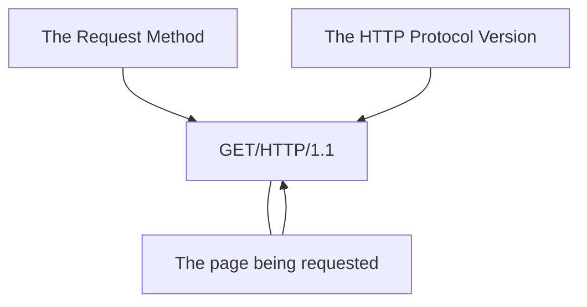

# 1. What is HTTP(S)? (**H**yper**T**ext **T**ransfer **P**rotocol)

**HTTP** is a set of rules used to communicate with web servers when transferring web page data, whether it's HTML, images, videos, etc.  

**HTTPS** is a secure version of HTTP.  

# 2. Requests And Responses  
When we visit a website, your browser sends requests to the web server to retrieve resources such as HTML code and images, and then downloads the responses. Before this can happen, the browser needs to know how and where to access these resources, and that's where URLs come in.

## What is a URL? (**U**niform **R**esource **L**ocator)

A URL address is essentially an instruction for accessing a resource on the internet.
  
The image shows what a URL address looks like with all its features $\color{red}{\textsf{(it doesn't use all the features in every request)}}$.  

**Scheme:** This instructs on what protocol to use for accessing the resource such as HTTP, HTTPS, FTP (File Transfer Protocol).

**User:** Some services require authentication to log in, you can put a username and password into the URL to log in.

**Host:** The domain name or IP address of the server you wish to access.

**Port:** The Port that you are going to connect to, usually 80 for HTTP and 443 for HTTPS, but this can be hosted on any port between 1 - 65535.

**Path:** The file name or location of the resource you are trying to access.

**Query String:** Extra bits of information that can be sent to the requested path. For example, /blog?id=1 would tell the blog path that you wish to receive the blog article with the id of 1.

**Fragment:** This is a reference to a location on the actual page requested. This is commonly used for pages with long content and can have a certain part of the page directly linked to it, so it is viewable to the user as soon as they access the page.

## Making a Request

It's possible to make a request to a web server with just one line GET / HTTP/1.1


But for a much richer web experience, you’ll need to send other data as well.  
## Example Request:
```
GET / HTTP/1.1

Host: tryhackme.com
User-Agent: Mozilla/5.0 Firefox/87.0
Referer: https://tryhackme.com/
```
To breakdown each line of this request:

***Line 1:** This request is sending the GET method, request the home page with / and telling the web server we are using HTTP protocol version 1.1.

**Line 2:** We tell the web server we want the website tryhackme.com

**Line 3:** We tell the web server we are using the Firefox version 87 Browser

**Line 4:** We are telling the web server that the web page that referred us to this one is https://tryhackme.com

**Line 5:** HTTP requests always end with a blank line to inform the web server that the request has finished.  

## Example Response:

```http
HTTP/1.1 200 OK

Server: nginx/1.15.8
Date: Fri, 09 Apr 2021 13:34:03 GMT
Content-Type: text/html
Content-Length: 98

<html>
<head>
    <title>TryHackMe</title>
</head>
<body>
    Welcome To TryHackMe.com
</body>
</html>
```
To breakdown each line of the response:

**Line 1:** HTTP 1.1 is the version of the HTTP protocol the server is using and then followed by the HTTP Status Code in this case "200 OK" which tells us the request has completed successfully.

**Line 2:** This tells us the web server software and version number.

**Line 3:** The current date, time and timezone of the web server.

**Line 4:** The Content-Type header tells the client what sort of information is going to be sent, such as HTML, images, videos, pdf, XML.

**Line 5:** Content-Length tells the client how long the response is, this way we can confirm no data is missing.

**Line 6:** HTTP response contains a blank line to confirm the end of the HTTP response.

**Lines 7-14:** The information that has been requested, in this instance the homepage.

# 2. HTTP Methods  

HTTP methods are the way a client can specify the desired action when sending an HTTP request. Only the GET and POST methods are commonly used.

**GET request** - This is used to retrieve information from a web server. $\color{red}{\textsf{(to get info from web-server)}}$

**POST request** - This is used to send data to a web server and potentially create new records. $\color{red}{\textsf{(to send info to web-server)}}$

**PUT request** - This is used to send data to a web server to update information. $\color{red}{\textsf{(to update info on web-server)}}$

**DELETE request** - This function is used to delete information/records from a web server. $\color{red}{\textsf{(to delete info from web-server)}}$


# 3. HTTP Status Codes:  

| Code | Description|
| :--- | :--- |
| 100-199 - Informational Response | These codes are sent to the client to inform them that the first part of their request has been accepted, and they should continue sending the remaining part of the request. |
| 200-299 - Success | This range of status codes is used to inform the client that their request was successfully completed. |
| 300-399 - Redirection | These codes are used to redirect the client's request to another resource. This could be either a different web page or a completely different website. |
| 400-499 - Client Errors | Used to inform the client about an error that occurred in their request. |
| 500-599 - Server Errors | This code is for errors that occur on the server side and usually indicates a fairly serious problem with the server processing the request. |  

## Typical HTTP status codes:

| Code | Description |
| :--- | :--- |
| 200 - OK | The request was successfully completed. |
| 201 - Created | A resource has been created (for example a new user or new blog post). |
| 301 - Moved Permanently | This redirects the client's browser to a new web page or informs search engines that the page has been moved to a different location and should be searched for there. |
| 302 - Found | Similar to the permanent redirect described above, but, as the name suggests, this is only a temporary change, and it may be reversed in the near future. |
| 400 - Bad Request | This informs the browser that something was wrong with the request or that something was missing.  Sometimes this can be used if the web server being accessed expects a specific parameter that the client did not send. |
| 401 - Not Authorised | Currently, accessing this resource is not possible without logging in to the web applications, most often using a username and password. |
| 403 - Forbidden | You do not have permission to view this resource, regardless of whether you are logged in or not. |
| 405 - Method Not Allowed | The resource does not support this request method; for example, you are sending a GET request to the /create-account resource when a POST request was expected. |
| 404 - Page Not Found | The page/resource you requested does not exist. |
| 500 - Internal Service Error | The server encountered an error while processing your request, and it doesn't know how to handle it correctly. |
| 503 - Service Unavailable | This server cannot process your request because it is either overloaded or offline for maintenance. |

https://http.cat/ $\color{red}{\textsf{a resource for learning about status codes}}$
