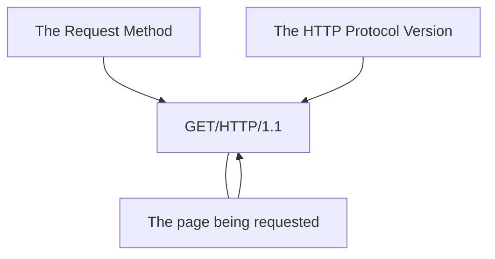

# 1. What is HTTP(S)? (**H**yper**T**ext **T**ransfer **P**rotocol)

**HTTP** is a set of rules used to communicate with web servers when transferring web page data, whether it's HTML, images, videos, etc.  

**HTTPS** is a secure version of HTTP.  

# 2. Requests And Responses  
When we visit a website, your browser sends requests to the web server to retrieve resources such as HTML code and images, and then downloads the responses. Before this can happen, the browser needs to know how and where to access these resources, and that's where URLs come in.

## What is a URL? (**U**niform **R**esource **L**ocator)

A URL address is essentially an instruction for accessing a resource on the internet.
  
The image shows what a URL address looks like with all its features $\color{red}{\textsf{(it doesn't use all the features in every request)}}$.  

**Scheme:** This instructs on what protocol to use for accessing the resource such as HTTP, HTTPS, FTP (File Transfer Protocol).

**User:** Some services require authentication to log in, you can put a username and password into the URL to log in.

**Host:** The domain name or IP address of the server you wish to access.

**Port:** The Port that you are going to connect to, usually 80 for HTTP and 443 for HTTPS, but this can be hosted on any port between 1 - 65535.

**Path:** The file name or location of the resource you are trying to access.

**Query String:** Extra bits of information that can be sent to the requested path. For example, /blog?id=1 would tell the blog path that you wish to receive the blog article with the id of 1.

**Fragment:** This is a reference to a location on the actual page requested. This is commonly used for pages with long content and can have a certain part of the page directly linked to it, so it is viewable to the user as soon as they access the page.

## Making a Request

It's possible to make a request to a web server with just one line GET / HTTP/1.1


But for a much richer web experience, you’ll need to send other data as well.  
## Example Request:
```
GET / HTTP/1.1

Host: tryhackme.com
User-Agent: Mozilla/5.0 Firefox/87.0
Referer: https://tryhackme.com/
```
To breakdown each line of this request:

Line 1: This request is sending the GET method, request the home page with / and telling the web server we are using HTTP protocol version 1.1.

Line 2: We tell the web server we want the website tryhackme.com

Line 3: We tell the web server we are using the Firefox version 87 Browser

Line 4: We are telling the web server that the web page that referred us to this one is https://tryhackme.com

Line 5: HTTP requests always end with a blank line to inform the web server that the request has finished.
