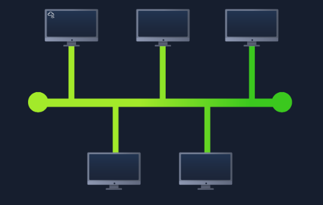
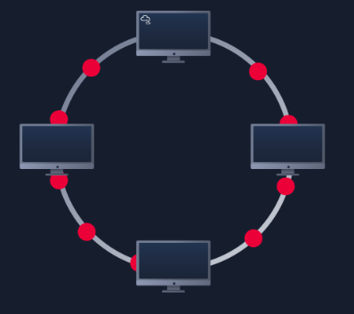
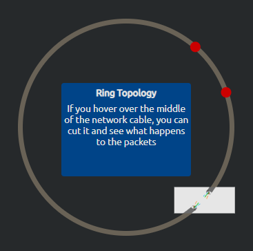

# Section: Intro to LAN
**Path:** Pre-Security  
**Date:** December 29,2025  
**Platform:** TryHackMe  

## 1. Introducing LAN Topologies  
There are different network architectures, and when we refer to the term "topology," we mean the visual layout of the network in question. Below, we will discuss the advantages and disadvantages of these topologies.

# **Star Topology:**

The basic principle of a star topology is that devices are connected to each other through a central network device, such as a switch or hub.
  
In this topology, data is sent through a central device to which all other devices are connected. Below, we will consider some of the advantages and disadvantages of this topology:
### Star Topology: Pros and Cons

| Advantages | Disadvantages | 
| :--- | :--- | 
| No Collisions: Data flows in one direction, reducing packet collisions. | Breakage: If one node or cable fails, the entire network is disrupted (Zero Fault Tolerance). | 
| Troubleshooting: Easy to identify where the connection is broken. | Reconfiguration: Adding or removing devices requires the whole network to go offline. | 

# **Bus Topology:**

This type of connection is based on a single connection known as a `trunk cable`.

Since all the data travels along a single cable, the data transfer speed slows down very quickly, creating a "bottleneck." This bottleneck also makes it significantly more difficult to find and resolve any malfunctions that may occur.
However, despite this, bus topologies are among the simplest and most cost-effective to set up.
### Bus Topology: Pros and Cons
| Advantages | Disadvantages |
| :--- | :--- |  
| **Simplicity:** Very easy to install and extend for small networks. | **SPOF:** The main backbone cable is a Single Point of Failure. | 
| **Cost:** Most cost-effective as it requires minimal cabling. | **Performance:** Significant bottlenecks as the number of devices increases. |
| **No Hubs/Switches:** Doesn't require expensive central network hardware. | **Security:** Every device sees all the data packets traveling on the backbone (privacy risk). |

# **Ring Topology:**  
In a ring topology, devices such as computers are connected directly to each other, forming a closed loop, which requires fewer wires and less reliance on specialized equipment compared to a star topology.  

  

However, if any device (computer) is damaged, or the wire connecting all these devices is damaged, data transmission will instantly stop, as shown in the photo below:

# **Conclusion:**
Ultimately, we know that while bus and ring topologies are both cheaper and simpler options, a star topology is more reliable, although it may be more expensive. The star topology wins due to its scalability and ease of troubleshooting. A star topology has a single point of failure—a central switch that, if it fails, will prevent all data transmission until it is repaired or replaced. From a security standpoint, protecting this central node is critical to maintaining the network's Availability.
