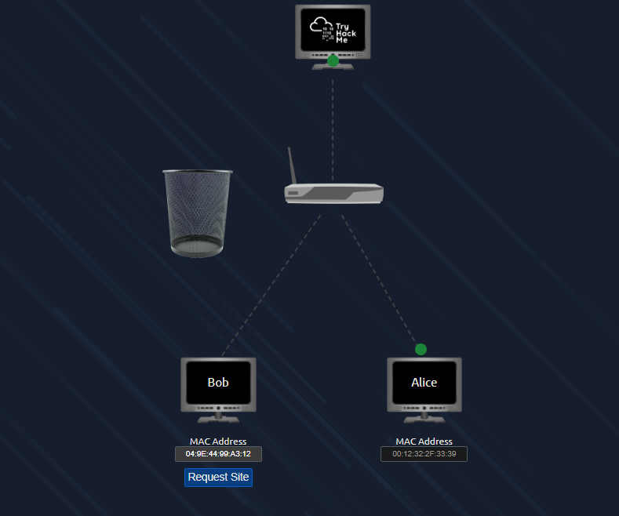
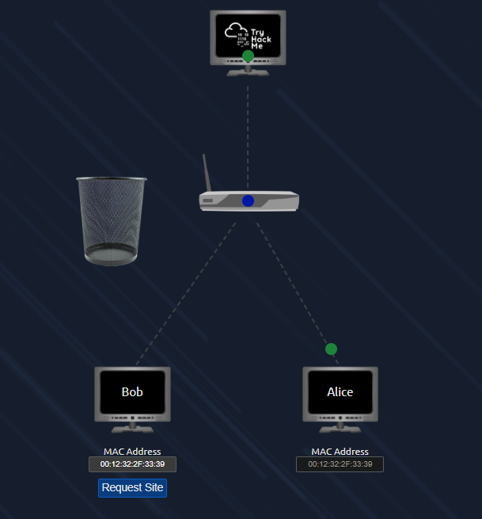

# Section: What is Networking?
**Path:** Pre-Security  
**Date:** December 29, 2025  
**Platform:** TryHackMe

## 1. Introduction to Networking
Networking is the concept of connecting devices to share resources and communicate. A network can range from just two devices to billions of devices globally, including laptops, phones, and even security cameras.

## 2. The Internet: A Network of Networks
The Internet is a massive collection of many smaller networks joined together. 
* **History:** The Internet started with the ARPANET project in the late 1960s.
* **World Wide Web (WWW):** Invented by Tim Berners-Lee in 1989.
* **Network Types:** Networks are categorized into **Private** (local) and **Public** (Internet) networks.

## 3. Identifying Devices on a Network
To communicate, every device needs unique identifiers.

### IP Addresses (Internet Protocol)
An IP address is a set of numbers used to identify a host for a period of time. 
* **IPv4:** Uses four octets (e.g., `192.168.1.1`), with each octet ranging from 0-255.
* **IPv6:** Developed to solve the shortage of IPv4 addresses, supporting 340 trillion-plus addresses and using a more efficient hexadecimal format.
* **Public vs. Private:** Private IPs are used for local communication, while a Public IP is assigned by an ISP to identify you on the global Internet.

### MAC Addresses (Media Access Control)
Unlike IP addresses, a MAC address is a unique 12-character hexadecimal number hardcoded into the device's network interface at the factory.
* **Format:** It is split into the Vendor ID (first 6 characters) and a unique device identifier (last 6 characters).
* **Spoofing:** MAC addresses can be "spoofed," allowing a device to pretend to be another for unauthorized access.
 

## 4. Practical Tool: Ping (ICMP)
I learned how to use the **Ping** command to test connectivity between devices.
* **Protocol:** Ping uses **ICMP** (Internet Control Message Protocol) packets.
* **Usage:** By running `ping <IP_Address>`, we can measure the performance (response time) and reliability of a connection.
* **Example:** Successfully pinged `8.8.8.8` to confirm Internet connectivity and retrieved a lab flag.

## Conclusion
Understanding the difference between logical addresses (IP) and physical addresses (MAC), as well as basic diagnostic tools like Ping, provides the essential foundation for network security analysis.
